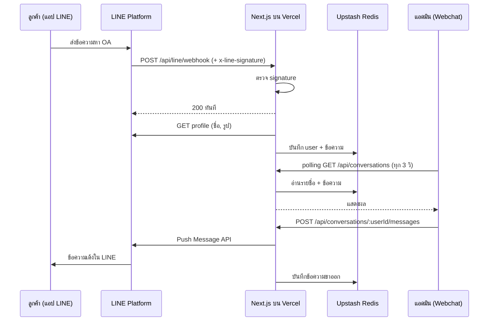

# LINE OA Webchat

หน้าจอแอดมินสำหรับรับและตอบข้อความของ LINE Official Account ผ่านเว็บ
ทำเป็น POC สำหรับแบบทดสอบ Webchat

- Demo: `https://<project>.vercel.app`
- เพิ่มเพื่อน OA: `https://line.me/R/ti/p/@<basic-id>`

## การตีความโจทย์

โจทย์ระบุว่าต้อง "เห็นว่า User ที่ส่งมาคือใคร และสามารถเลือก User เพื่อตอบกลับได้"
จึงตีความว่า webchat คือหน้าจอของแอดมิน OA ไม่ใช่ widget ให้ลูกค้าพิมพ์บนเว็บ

- ลูกค้าแชทกับ OA ผ่านแอป LINE ตามปกติ
- แอดมินเปิด webchat เห็นรายชื่อลูกค้า เลือกคน แล้วพิมพ์ตอบในนาม OA

## สถาปัตยกรรม



| ส่วน | เลือก | เหตุผล |
| --- | --- | --- |
| Framework | Next.js 16 (App Router) + TypeScript | ตามโจทย์ |
| Backend | Route Handlers | ไม่ต้องมี server แยก deploy ที่ Vercel ที่เดียว |
| Storage | Upstash Redis | function บน Vercel เก็บ state ใน memory ไม่ได้ และ Redis ต่อผ่าน HTTP ได้ |
| Realtime | Polling ด้วย SWR ทุก 3 วินาที | เรียบง่ายพอสำหรับ POC (WebSocket บน Vercel ยังเป็น beta) |
| ส่งข้อความ | Push Message API | ตอบได้ทุกเมื่อ ส่วน reply token ใช้ได้แค่ 1 นาที |

โครงสร้างโค้ด

```
src/
├─ app/
│  ├─ page.tsx                               หน้า webchat
│  └─ api/
│     ├─ line/webhook/route.ts               รับ event จาก LINE
│     ├─ auth/route.ts                       ตรวจรหัสเข้าใช้งาน
│     └─ conversations/
│        ├─ route.ts                         GET รายชื่อ user
│        └─ [userId]/messages/route.ts       GET ประวัติ, POST ส่งข้อความ
├─ components/                               UI ฝั่ง client
├─ lib/
│  ├─ store.ts                               ไฟล์เดียวที่รู้จัก Redis
│  ├─ line.ts                                LINE client และตัวจัดการ event
│  └─ auth.ts                                passcode gate
└─ types/chat.ts
```

## Setup

ต้องใช้ Node.js 22 ขึ้นไป และ pnpm

1. สร้าง LINE Official Account ที่ [LINE Official Account Manager](https://manager.line.biz)
   แล้วเปิด Messaging API ใน Settings
2. ที่ [LINE Developers Console](https://developers.line.biz/console) คัดลอก Channel secret
   และออก Channel access token (long-lived)
3. Import repo นี้เข้า Vercel แล้วเชื่อม Upstash Redis ผ่านแท็บ Storage
4. ใส่ environment variables บน Vercel แล้ว redeploy

   | ตัวแปร | ที่มา |
   | --- | --- |
   | `LINE_CHANNEL_SECRET` | Developers Console → Basic settings |
   | `LINE_CHANNEL_ACCESS_TOKEN` | Developers Console → Messaging API |
   | `KV_REST_API_URL`, `KV_REST_API_TOKEN` | Vercel ใส่ให้เมื่อเชื่อม Upstash (รองรับ `UPSTASH_REDIS_REST_*` ด้วย) |
   | `APP_PASSCODE` | ตั้งเอง ถ้าไม่ตั้งจะเปิดให้เข้าได้ทุกคน |

5. ตั้ง Webhook URL ใน Developers Console เป็น `https://<project>.vercel.app/api/line/webhook`
   เปิด Use webhook แล้วกด Verify
6. ปิด Auto-reply messages ใน OA Manager → Response settings

รันบนเครื่อง

```bash
pnpm install
vercel link
vercel env pull .env.local
pnpm dev
```

## ข้อจำกัดที่รู้

- **โควตา Push**: แพ็กเกจฟรีของ LINE OA ในไทยส่งได้ 300 ข้อความต่อเดือน เมื่อเต็มจะส่งไม่ได้จนถึงเดือนถัดไป
- **ผู้ใช้ที่ block OA**: LINE ตอบ `200` ให้ Push แม้ข้อความไม่ถึง หน้าเว็บจึงแสดงว่าส่งสำเร็จ
- **ข้อความที่ไม่ใช่ text**: รูป สติกเกอร์ และไฟล์ แสดงเป็น placeholder เช่น `[รูปภาพ]`
- **Webhook**: ตอบ `200` ก่อนแล้วประมวลผลทีหลัง เพราะ LINE ให้เวลาตอบ 2 วินาที ถ้าประมวลผลล้มเหลว event นั้นจะหาย
- **Passcode**: เป็นรหัสเดียวใช้ร่วมกัน ไม่มีการจำกัดจำนวนครั้งที่ลอง
- **Polling**: ทุกแท็บที่เปิดอยู่ใช้ command ของ Redis ต่อเนื่อง (free tier มี 500K ต่อเดือน) และหยุดเองเมื่อแท็บถูกซ่อน
- **ประวัติ**: เก็บ 500 ข้อความล่าสุดต่อคน แสดง 100 ข้อความล่าสุด และรายชื่อ 50 คนล่าสุด

## ต่อยอด

- ใช้ Reply API เมื่อ reply token ยังไม่หมดอายุ (ไม่กินโควตา) แล้ว fallback เป็น Push
- จัดการ event `unfollow` เพื่อบอกแอดมินว่าผู้ใช้ block แล้ว
- แสดงรูปและไฟล์จริง และตัวนับข้อความที่ยังไม่อ่าน
- เปลี่ยน polling เป็น WebSocket หรือ SSE
- ระบบ login รายคนและการมอบหมายงานระหว่างแอดมิน
- Automated tests สำหรับการตรวจ signature และการกัน event ซ้ำ
