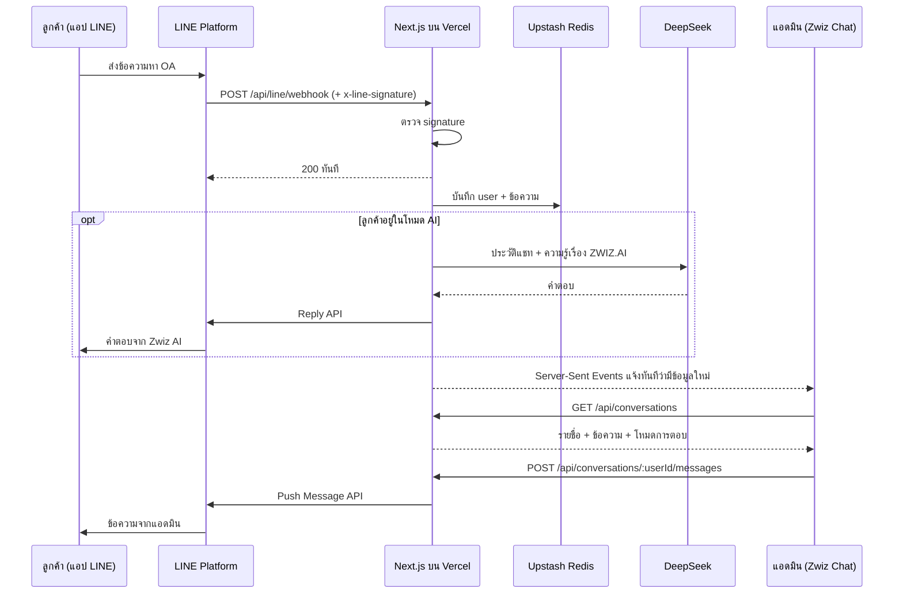

# Zwiz Chat

กล่องข้อความสำหรับแอดมิน รับและตอบแชทของ LINE Official Account ผ่านเว็บ
พร้อม Zwiz AI ที่ช่วยตอบคำถามเรื่องบริการของ ZWIZ.AI เมื่อลูกค้ากด "ถาม AI"

> เดโมสำหรับแบบทดสอบ Webchat ไม่ใช่ผลิตภัณฑ์ทางการของ ZWIZ.AI
> ข้อมูลที่ AI ใช้ตอบสรุปจากหน้าเว็บสาธารณะ https://zwiz.ai/th

- Demo: `https://<project>.vercel.app`
- เพิ่มเพื่อน OA: https://line.me/R/ti/p/@611nrixg (zwiz.ai-by-fent)

## การตีความโจทย์

โจทย์ระบุว่าต้อง "เห็นว่า User ที่ส่งมาคือใคร และสามารถเลือก User เพื่อตอบกลับได้"
จึงตีความว่า webchat คือหน้าจอของแอดมิน OA ไม่ใช่ widget ให้ลูกค้าพิมพ์บนเว็บ

- ลูกค้าแชทกับ OA ผ่านแอป LINE ตามปกติ
- แอดมินเปิด Zwiz Chat เห็นรายชื่อลูกค้า เลือกคน แล้วพิมพ์ตอบในนาม OA

ส่วนที่ทำเกินโจทย์คือ Zwiz AI และการรับช่วงต่อระหว่าง AI กับแอดมิน
ซึ่งเป็นแนวคิดเดียวกับ "แอดมินทำงานร่วมกับบอทได้" ของ ZWIZ.AI

## Zwiz AI ทำงานอย่างไร

1. ลูกค้ากดปุ่ม "ถาม AI" ใน rich menu ของ LINE (หรือพิมพ์คำนี้เอง) ระบบเปิดโหมด AI ให้ลูกค้ารายนั้น
2. ข้อความถัดไปของลูกค้าถูกส่งให้ DeepSeek (`deepseek-flash`) พร้อมประวัติแชท 12 ข้อความล่าสุด
3. คำตอบส่งกลับด้วย Reply API ซึ่งไม่กินโควตา Push ของ OA
4. โหมด AI ปิดเมื่อลูกค้ากด "คุยกับแอดมิน" เมื่อแอดมินพิมพ์ตอบเอง หรือกด "รับช่วงต่อจาก AI"

ในหน้าเว็บ ข้อความของแอดมินเป็นบับเบิลดำ ของ Zwiz AI เป็นบับเบิลชมพูอ่อน
และทุกครั้งที่สลับผู้ตอบจะมีบันทึกเหตุการณ์คั่นในแชท

ข้อจำกัดที่ตั้งไว้ให้ AI

- ตอบจากความรู้ใน `src/lib/zwiz-knowledge.ts` เท่านั้น ถ้าไม่มีข้อมูลให้บอกตรง ๆ และเสนอคุยกับแอดมิน
- ไม่รับปาก ไม่เสนอส่วนลด และไม่นัดหมายแทนทีมงาน
- จำกัด 30 คำตอบต่อคนต่อชั่วโมง และ 500 คำตอบต่อวันทั้งระบบ
- ถ้า DeepSeek ล้มเหลวหรือเกินโควตา ระบบแจ้งลูกค้าและส่งต่อให้แอดมินอัตโนมัติ

## สถาปัตยกรรม



| ส่วน | เลือก | เหตุผล |
| --- | --- | --- |
| Framework | Next.js 16 (App Router) + TypeScript | ตามโจทย์ |
| Backend | Route Handlers | ไม่ต้องมี server แยก deploy ที่ Vercel ที่เดียว |
| Storage | Upstash Redis | function บน Vercel เก็บ state ใน memory ไม่ได้ และ Redis ต่อผ่าน HTTP ได้ ทุก key ขึ้นต้นด้วย `zwiz-chat:` จึงใช้ฐานข้อมูลร่วมกับโปรเจกต์อื่นได้ |
| Realtime | Server-Sent Events + Redis Pub/Sub | server ดันเหตุการณ์ไปหน้าเว็บทันทีที่มีข้อมูลใหม่ และมี polling ทุก 30 วินาทีเป็นตัวสำรอง |
| แอดมินตอบ | Push Message API | ตอบได้ทุกเมื่อ ส่วน reply token ใช้ได้แค่ 1 นาที |
| AI ตอบ | Reply API + DeepSeek | AI ตอบทันทีจึงทัน reply token และไม่กินโควตา Push |

โครงสร้างโค้ด

```
src/
├─ app/
│  ├─ page.tsx                               หน้า Zwiz Chat
│  └─ api/
│     ├─ line/webhook/route.ts               รับ event จาก LINE
│     ├─ auth/route.ts                       ตรวจรหัสเข้าใช้งาน
│     ├─ events/route.ts                     GET สตรีมเหตุการณ์แบบ Server-Sent Events
│     └─ conversations/
│        ├─ route.ts                         GET รายชื่อ user
│        └─ [userId]/
│           ├─ messages/route.ts             GET ประวัติ, POST ส่งข้อความ
│           ├─ mode/route.ts                 POST สลับผู้ตอบ (แอดมิน หรือ AI)
│           └─ read/route.ts                 POST ล้างตัวนับข้อความที่ยังไม่อ่าน
├─ components/                               UI ฝั่ง client
├─ lib/
│  ├─ store.ts                               ไฟล์เดียวที่รู้จัก Redis
│  ├─ line.ts                                LINE client และตัวจัดการ event
│  ├─ ai.ts                                  เรียก DeepSeek และ system prompt
│  ├─ zwiz-knowledge.ts                      ความรู้ที่ AI ใช้ตอบ
│  └─ auth.ts                                passcode gate
└─ types/chat.ts
```

## Setup

ต้องใช้ Node.js 22 ขึ้นไป และ pnpm

1. สร้าง LINE Official Account ที่ [LINE Official Account Manager](https://manager.line.biz)
   แล้วเปิด Messaging API ใน Settings
2. ที่ [LINE Developers Console](https://developers.line.biz/console) คัดลอก Channel secret
   และออก Channel access token (long-lived)
3. Import repo นี้เข้า Vercel แล้วเชื่อม Upstash Redis ผ่านแท็บ Storage
4. ใส่ environment variables บน Vercel แล้ว redeploy

   | ตัวแปร | ที่มา |
   | --- | --- |
   | `LINE_CHANNEL_SECRET` | Developers Console → Basic settings |
   | `LINE_CHANNEL_ACCESS_TOKEN` | Developers Console → Messaging API |
   | `KV_REST_API_URL`, `KV_REST_API_TOKEN` | Vercel ใส่ให้เมื่อเชื่อม Upstash (รองรับ `UPSTASH_REDIS_REST_*` ด้วย) |
   | `APP_PASSCODE` | ตั้งเอง ยาวอย่างน้อย 12 ตัวอักษร ถ้าไม่ตั้งจะเปิดให้เข้าได้ทุกคน |
   | `DEEPSEEK_API_KEY` | [DeepSeek Platform](https://platform.deepseek.com) ถ้าไม่ตั้ง ปุ่ม "ถาม AI" จะไม่แสดง |

5. ตั้ง Webhook URL ใน Developers Console เป็น `https://<project>.vercel.app/api/line/webhook`
   เปิด Use webhook แล้วกด Verify
6. ใน OA Manager → Response settings ปิด Auto-reply messages และ Greeting message
   (ระบบนี้ส่งข้อความทักทายพร้อมปุ่ม "ถาม AI" เองเมื่อมีคนเพิ่มเพื่อน)
7. ตั้ง rich menu ของ OA ให้มีปุ่ม "ถาม AI" และ "คุยกับแอดมิน" ติดอยู่ล่างแชทตลอด
   ด้วย `pnpm richmenu` (อ่าน token จาก `.env.local` รันครั้งเดียว และรันซ้ำได้)

รันบนเครื่อง

```bash
pnpm install
vercel link
vercel env pull .env.local
pnpm dev
```

## ข้อจำกัดที่รู้

- **โควตา Push**: แพ็กเกจฟรีของ LINE OA ในไทยส่งได้ 300 ข้อความต่อเดือน นับเฉพาะข้อความที่แอดมินพิมพ์ตอบ ข้อความจาก AI ไม่นับ
- **ผู้ใช้ที่ block OA**: LINE ตอบ `200` ให้ Push แม้ข้อความไม่ถึง หน้าเว็บจึงแสดงว่าส่งสำเร็จ
- **ข้อความที่ไม่ใช่ text**: รูป สติกเกอร์ และไฟล์ แสดงเป็น placeholder เช่น `[รูปภาพ]` และ AI อ่านไม่ได้
- **Webhook**: ตอบ `200` ก่อนแล้วประมวลผลทีหลัง เพราะ LINE ให้เวลาตอบ 2 วินาที ถ้าประมวลผลล้มเหลว event นั้นจะหาย
- **ความรู้ของ AI**: เป็นข้อความคงที่ในโค้ด ถ้าหน้าเว็บ ZWIZ.AI เปลี่ยน ต้องแก้ไฟล์ตาม
- **ปุ่มสลับผู้ตอบ**: อยู่ใน rich menu ซึ่งแสดงเฉพาะ LINE บนมือถือ ส่วน LINE บน PC ไม่แสดงทั้ง rich menu และ quick reply ลูกค้าต้องพิมพ์ "ถาม AI" หรือ "คุยกับแอดมิน" เอง
- **Passcode**: เป็นรหัสเดียวใช้ร่วมกัน กรอกได้ 20 ครั้งต่อ IP ต่อ 10 นาที
- **Realtime**: ใช้ Server-Sent Events ทางเดียวจาก server ไปหน้าเว็บ การเชื่อมต่อถูกตัดตามเพดานเวลาของ function บน Vercel (300 วินาที) แล้วเบราว์เซอร์ต่อใหม่เอง
- **การแจ้งเตือน**: จำนวนข้อความที่ยังไม่อ่านขึ้นที่ชื่อแท็บ ส่วนการแจ้งเตือนของเบราว์เซอร์ต้องกดอนุญาตก่อน และทำงานเฉพาะตอนที่ยังเปิดหน้าเว็บค้างไว้
- **ประวัติ**: เก็บ 500 ข้อความล่าสุดต่อคน แสดง 100 ข้อความล่าสุด และรายชื่อ 50 คนล่าสุด

## ต่อยอด

- เชื่อมช่องทางอื่น (Facebook, Instagram, TikTok, WhatsApp) เข้ากล่องข้อความเดียวกัน
- ป้ายกำกับ สถานะ โน้ต และข้อความสำเร็จรูป
- AI สรุปการคุยและแปลภาษาให้แอดมิน
- จัดการ event `unfollow` เพื่อบอกแอดมินว่าผู้ใช้ block แล้ว
- แสดงรูปและไฟล์จริง
- Web Push เพื่อแจ้งเตือนแม้ปิดหน้าเว็บไปแล้ว
- ระบบ login รายคนและการมอบหมายงานระหว่างแอดมิน
- Automated tests สำหรับการตรวจ signature การกัน event ซ้ำ และการสลับโหมด AI
